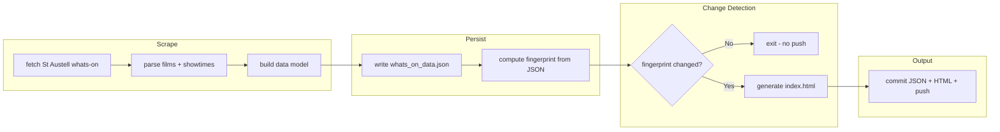

**Status: Implemented.** See [README.md](README.md) for current usage and deployment.

# WTW Cinemas Stylish HTML Listings Page (original plan)

## Summary

Build on the existing repo by adding a new scraper for the **whats-on** page (current showtimes), store results in a JSON file, generate a Web3-style HTML page, and run a GitHub Actions workflow that only commits when the film lineup changes.

**Cinema scope:** WTW has multiple cinemas (St Austell, Newquay, Truro, Wadebridge), each with different movies. We only monitor the **main one (St Austell)** for simplicity; the JSON structure still allows for multiple cinemas later if needed.

**Value proposition:** The cinema site lists times and booking; this site gives people a reason to visit by adding **richer information** they can't get there: ratings, trailers, posters, genres, and links to IMDB, Rotten Tomatoes, and Trakt. The page should clearly position itself as "more than the cinema" (e.g. header or short tagline: "What's on at WTW St Austell — with ratings, trailers & links").

---

## Architecture



---

## 1. New Script: `whats_on_scraper.py`

**Purpose:** Scrape the main cinema (St Austell) [whats-on page](https://wtwcinemas.co.uk/st-austell/whats-on/) and **store data in JSON**, then generate HTML. Multi-cinema is acknowledged (other venues have different lineups) but only St Austell is scraped.

**JSON data file: `whats_on_data.json`**

- Single source of truth: scraper always writes this file first.
- Structure supports multiple cinemas for future use; for now one key, e.g. `"st-austell"`:

```json
{
  "updated_at": "2026-02-08T12:00:00Z",
  "cinemas": {
    "st-austell": {
      "name": "White River Cinema, St Austell",
      "url": "https://wtwcinemas.co.uk/st-austell/whats-on/",
      "films": [
        {
          "title": "Send Help (15)",
          "search_title": "Send Help",
          "synopsis": "...",
          "cast": "Rachel McAdams, Dylan O'Brien",
          "runtime_min": 113,
          "film_url": "https://wtwcinemas.co.uk/film/send-help/?screen=st-austell",
          "showtimes": [
            { "date": "2026-02-09", "time": "17:15", "screen": 1, "booking_url": "...", "tags": ["2D", "Audio Description"] }
          ]
        }
      ]
    }
  }
}
```

**Data to extract (per film):**

- Title, search_title (for IMDB/Trakt/RT links), synopsis, cast, runtime
- Film URL (WTW booking page)
- Showtimes: `{date, time, screen, booking_url, tags}`

**Implementation approach:**

- **Standalone script:** Implement `fetch_with_retries`, `USER_AGENT`, and logging inside `whats_on_scraper.py` (copy patterns from existing code as reference only; do not depend on or keep the old script).
- Parse the whats-on page HTML; build the structure above for `st-austell` only
- **TMDb:** Read API key from `os.environ.get("TMDB_API_KEY")` only—never hardcode. If set, enrich each film with poster, trailer, genre (and optionally `imdb_id`); if unset, skip enrichment.
- Write `whats_on_data.json` first; then compute fingerprint from it; then generate `index.html` only if fingerprint changed

**Movie database links (search URLs, no API keys):**

| Site            | URL format                                             |
| --------------- | ------------------------------------------------------ |
| IMDB            | `https://www.imdb.com/find/?q={title}`                 |
| Rotten Tomatoes | `https://www.rottentomatoes.com/search?search={title}` |
| Trakt           | `https://trakt.tv/search?query={title}`                |

Title for search: strip "(15)", "(with subtitles)", etc. to get base film name (e.g. "Send Help").

---

## 2. Conditional Regeneration Logic

**Fingerprint:** Derived from the **JSON file** so we don't regenerate or push when nothing changed:

- After writing `whats_on_data.json`, compute a hash of its canonical form (e.g. sorted film titles + showtime count + date range, or hash of the whole JSON string).
- Compare with previous fingerprint (stored in repo, e.g. in a small `.whats_on_fingerprint` file, or by comparing previous JSON).

**Flow:**

1. Scrape → build data → **write `whats_on_data.json`**
2. Compute fingerprint from JSON
3. If fingerprint unchanged → exit without writing HTML or committing
4. If changed → write `index.html`, update fingerprint, commit `whats_on_data.json` + `index.html` (+ fingerprint if used) and push

---

## 3. HTML Design (Web3 Style)

**Aesthetic:**

- Dark background (`#0a0a0f` or similar)
- Accent colors: cyan `#00d4ff`, purple `#a855f7`, gradient borders
- Typography: distinctive sans (e.g. "Space Grotesk" or "JetBrains Mono" via Google Fonts)
- Card layout with subtle glow / gradient border on hover
- Responsive grid

**Structure:**

- Header + short tagline that reflects the value prop (e.g. "What's on at WTW St Austell — ratings, trailers & links to more").
- Date filter tabs: Today, Tomorrow, Tue, Wed, etc. (or "All")
- Film cards: title, runtime, **rating** (e.g. TMDb score), cast, synopsis snippet, showtimes grouped by date
- Each card: WTW Book link + external links (IMDB, Trakt, Rotten Tomatoes) so users can dig into reviews and info.
- Footer: last updated, link to WTW website

**Implementation:** Single self-contained `index.html` (inline CSS + minimal JS for filtering) so GitHub Pages serves it without a build step.

---

## 3b. Card Features and API Requirements

**Single API: TMDb only.** All API-backed features use **one service** (TMDb) so only **one API key** is needed. No OMDb or other keys.

| Feature                  | Needs API? | Notes                                                                                                                               |
| ------------------------ | ---------- | ----------------------------------------------------------------------------------------------------------------------------------- |
| **Poster image**         | Yes (TMDb) | TMDb returns poster path; use `https://image.tmdb.org/t/p/w342/{path}`.                                                             |
| **Trailer**              | Yes (TMDb) | TMDb "videos" endpoint returns YouTube key; link `youtube.com/watch?v={key}`.                                                       |
| **Rating**               | Yes (TMDb) | TMDb returns `vote_average` (e.g. 7.2). Show on card as e.g. "7.2/10" — gives users a reason to use this site over the cinema.      |
| **Genre**                | Yes (TMDb) | TMDb returns genre names (e.g. "Drama", "Thriller").                                                                                 |
| **Age rating**           | No         | Parse from title: "(15)", "(12A)" etc. and show the **official BBFC rating logo** (see 3b below), not plain text.                   |
| **Accessibility badges** | No         | Already in scraped showtime `tags`: "Audio Description", "Subtitles", "Wheelchair access", "Silver Screen". Render as small badges. |
| **Screen number**        | No         | Already in each showtime (`screen`). Show "Screen 1" etc. next to each time.                                                        |
| **Add to calendar**      | No         | Per showtime: generate .ics or "Add to Google Calendar" URL (film title + date/time + cinema). No external API.                     |
| **Last updated**         | No         | Use `updated_at` from `whats_on_data.json` in footer: "Listings updated 8 Feb 2026, 12:00".                                         |

**API key: never hardcoded.** The script reads the key from an **environment variable** (e.g. `TMDB_API_KEY`). In GitHub Actions, the workflow passes it from **repository secrets** so the key never appears in code or logs.

- Script: `api_key = os.environ.get("TMDB_API_KEY")`. If missing, skip TMDb enrichment (no poster/trailer/genre); scraping and HTML generation still run.
- Workflow: add `env: TMDB_API_KEY: ${{ secrets.TMDB_API_KEY }}` to the step that runs the script (or at job level).
- Repo setup: in GitHub → Settings → Secrets and variables → Actions, add a secret named `TMDB_API_KEY` (get a free key at [themoviedb.org](https://www.themoviedb.org/settings/api)).

**JSON enrichment (when key is set):** Per film, after scraping, call TMDb search by `search_title`; store `poster_url`, `trailer_url` (YouTube), `vote_average` (rating), `genres`, and optionally `imdb_id` (for direct IMDB link) in the film object.

---

## 3c. Caching to Reduce Runtime and API Calls (Free GitHub Actions)

Caching cuts TMDb API calls and runtime so the workflow stays fast and within free-tier limits.

**TMDb cache (by film slug):**

- Cache file: `.tmdb_cache.json`, keyed by film slug (e.g. `send-help`) or `search_title`.
- Store: `poster_url`, `trailer_url`, `vote_average`, `genres`, `imdb_id`, plus `cached_at`.
- Expiry: 7 days (configurable). If cache hit and not expired, skip TMDb entirely for that film.
- **Persist across runs:** Commit `.tmdb_cache.json` when it changes so the next Actions run has the cache. Include it in the "commit if changed" step (alongside `whats_on_data.json`, `index.html`).
- Effect: most films stay the same week to week → 0 TMDb calls for cached films; only new films trigger API requests.

**Optional: WTW HTML cache (local dev):**

- Cache the raw whats-on HTML for e.g. 1 hour (file or memory). Useful when running the script repeatedly while developing; each Actions run is usually once per day so this has limited impact there.
- If implemented: key by URL, store `{html, fetched_at}`; skip fetch if `fetched_at` within 1 hour.

**Other optimizations for free Actions:**

- **Sequential TMDb requests** with a small delay (e.g. 0.2s) between calls to avoid rate limits.
- **Minimize TMDb calls per film:** use `append_to_response=videos` (or similar) on the movie details request so search + one details call cover poster, rating, genres, and trailer.
- **Early exit:** if fingerprint unchanged, exit before writing HTML—saves a bit of CPU.
- **Dependencies:** `requirements.txt` is small; `actions/setup-python` with `cache: 'pip'` reuses the venv across runs.

---

## 4. GitHub Actions Workflow

**New workflow:** `.github/workflows/whats_on_html.yml`

- Trigger: schedule (e.g. daily 09:00 UTC) + `workflow_dispatch`
- Steps:
  1. Checkout (includes `.tmdb_cache.json` from previous run if committed)
  2. Set up Python with `cache: 'pip'`, install `requests`, `beautifulsoup4`
  3. Run the scraper with the TMDb API key from secrets:
    - Set `TMDB_API_KEY` from GitHub Actions secrets so it is **never hardcoded** in the repo.
    - Example: pass as env to the run step:
      ```yaml
      env:
        TMDB_API_KEY: ${{ secrets.TMDB_API_KEY }}
      ```
    - Script reads `os.environ.get("TMDB_API_KEY")`; if unset, runs without poster/trailer/genre.
  4. If data changed (or cache changed): commit `whats_on_data.json`, `index.html`, `.tmdb_cache.json`, and optional `.whats_on_fingerprint`; push

**Permissions:** `contents: write` for push.

**Repo setup:** In GitHub → Settings → Secrets and variables → Actions, add secret `TMDB_API_KEY` (free key at [themoviedb.org/settings/api](https://www.themoviedb.org/settings/api)).

**Age rating badges (BBFC logos):** Use the **official BBFC age rating symbols** so the card shows the proper logos (U, PG, 12A, 12, 15, 18, R18), not plain text. BBFC symbols are available as public-domain SVG on Wikimedia Commons; use these for consistency and recognition:

- **U** – [BBFC U](https://commons.wikimedia.org/wiki/Category:BBFC_rating_symbols) (Commons category; pick current SVG if available)
- **PG** – [BBFC PG 2019.svg](https://commons.wikimedia.org/wiki/File:BBFC_PG_2019.svg)
- **12A** – [BBFC 12A 2019.svg](https://commons.wikimedia.org/wiki/File:BBFC_12A_2019.svg) (theatrical; use for cinema listings)
- **12** – 12 symbol for VOD/media if needed
- **15** – [BBFC 15.svg](https://commons.wikimedia.org/wiki/File:BBFC_15.svg)
- **18** – [BBFC 18 2019.svg](https://commons.wikimedia.org/wiki/File:BBFC_18_2019.svg)
- **R18** – search Commons for R18 if needed

**Implementation:** Either (1) embed SVGs inline or (2) host small copies in the repo (e.g. `assets/bbfc-15.svg`) or (3) use Wikimedia's direct image URLs (e.g. `https://upload.wikimedia.org/wikipedia/commons/...`) so no hot-linking policy issues. Prefer (2) or inline SVG so the page works offline and doesn't depend on Commons. Parse rating from film title (e.g. "(15)" → 15, "(12A)" → 12A), map to the correct BBFC logo, and render at ~24–30px height per BBFC guidance.

---

## 5. GitHub Pages Setup

- Output: `docs/index.html` and assets under `docs/` (posters, certs, icons)
- Enable GitHub Pages: Settings → Pages → Source: Deploy from branch → Branch: `main` → Folder: **/docs** (GitHub only offers /(root) and /docs)
- Result: [https://evenwebb.github.io/wtw-whats-on](https://evenwebb.github.io/wtw-whats-on)

---

## 6. Files to Create/Modify

**Create / keep:**

| File                                  | Action                                                                           |
| ------------------------------------- | -------------------------------------------------------------------------------- |
| `whats_on_scraper.py`                 | Create – standalone script (no imports from old code); scrape, cache, JSON, HTML |
| `whats_on_data.json`                  | Created by script – committed when data changes (source of truth)                |
| `.tmdb_cache.json`                    | Created by script – committed when changed; reduces TMDb API calls on next run   |
| `.github/workflows/whats_on_html.yml` | Create – scheduled + manual run, conditional commit/push; use `cache: 'pip'`     |
| `.gitignore`                          | Add `.whats_on_fingerprint` only if used (optional); do **not** ignore cache     |
| `requirements.txt`                    | Keep (requests, beautifulsoup4)                                                  |

**Remove (existing code is reference only; don't keep it for the new product):**

| File                                  | Action                                                         |
| ------------------------------------- | -------------------------------------------------------------- |
| `cinema_scraper.py`                   | Remove – was base for new script; new script is self-contained |
| `.github/workflows/scrape_cinema.yml` | Remove – calendar workflow; replaced by whats_on_html.yml      |
| `wtw_cinema.ics`                      | Remove – calendar output; not needed for HTML listings         |
| `.film_cache.json`                    | Remove – cache for old scraper; replaced by `.tmdb_cache.json` |

Optional: update README to describe the HTML listings product and GitHub Pages. Omit or remove `cinema_log.txt` if it was only for the old scraper.

---

## 7. HTML Parsing Strategy (Whats-On Page)

The fetched page structure shows:

- Film sections with `h2` titles and links to `/film/{slug}/`
- Date labels ("Today 8 February 2026", "Tomorrow 9 February 2026")
- Time slots with booking links (`/book?performance=...`)

Parsing approach:

- Use BeautifulSoup to find film blocks (e.g. sections or list items containing film info)
- Extract title, synopsis, cast, runtime from each block
- Within each block, find date groupings and time links
- Build a structured list of films with showtimes for template rendering

---

## Open Questions

1. **Fingerprint storage:** Prefer storing `.whats_on_fingerprint` in repo (track changes) or only in workflow (e.g. compare `whats_on_data.json` with `git show HEAD:whats_on_data.json`)? Option: commit JSON every run and use `git diff --exit-code whats_on_data.json` to decide whether to also commit HTML — then fingerprint file is unnecessary.
